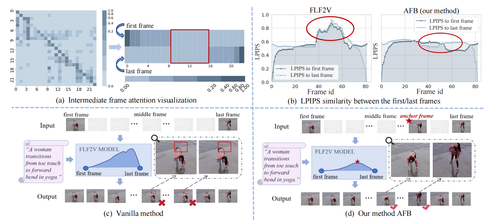
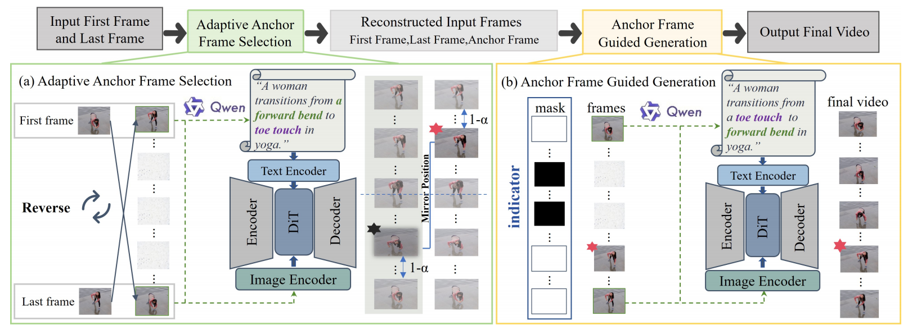

# Anchor Frame Bridging for Coherent First-Last Frame Video Generation

<p align="center">
  
  
  
</p>

<p align="center">
  <a href="https://openreview.net/forum?id=isNjWnVsUR">📄 Paper</a> •
  <a href="#installation">🔧 Installation</a> •
  <a href="#quick-start">🚀 Quick Start</a> •
  <a href="#examples">📁 Examples</a>
</p>

## 🎬 Demo

https://github.com/user-attachments/assets/26e18f08-7fb7-41c3-a5f6-1942d4c88917

## 📖 Introduction

**"Anchor Frame Bridging for Coherent First-Last Frame Video Generation"** is accepted at **ICLR 2026**.

**First-Last Frame Video Generation (FLF2V)** has recently gained significant attention as it enables coherent motion generation between specified first and last frames. However, existing approaches suffer from **semantic degradation in intermediate frames**, causing scene distortion and subject deformation that undermine temporal consistency.

To address this issue, we introduce **Anchor Frame Bridging (AFB)**, a novel **plug-and-play** method that explicitly bridges semantic continuity from boundary frames to intermediate frames, offering **training-free adaptability and generalizability**. By adaptively interpolating anchor frames at temporally critical locations exhibiting maximal semantic discontinuities, our approach effectively mitigates semantic drift in intermediate frames.

<p align="center">
  
</p>

### Key Contributions

- **Anchor Frame Bridging (AFB)**: A method that bridges semantic continuity between first-last frames through anchor frame interpolation, mitigating intermediate distortion and resolving temporal inconsistency in FLF2V generation.

- **Plug-and-Play Design**: AFB operates in two stages without requiring any training:
  1. **Adaptive Anchor Frame Selection**: Temporal continuity analysis via frame order reversal and selection based on semantic continuity
  2. **Anchor Frame-Guided Generation**: Leveraging selected anchors to guide semantic propagation for coherent videos


## ✨ Method Overview

<p align="center">
  
</p>

### Adaptive Anchor Frame Selection

The core insight is that in self-attention layers, only adjacent frames have significant inter-frame attention values, causing lower attention weights from the first/last frames to intermediate ones. This results in poor temporal consistency - frames near the boundary show higher generation consistency, while those in the mid-to-late part show reduced coherence.

**Our solution:**
1. **Reverse Generation**: Swap the first and last frames and generate a reverse video using Qwen to create a reverse-direction prompt
2. **Quality Assessment**: Identify the frame with the worst quality (highest LPIPS with neighbors) in the forward generation
3. **Mirror Selection**: Select the anchor frame from the reverse generation at the mirrored position (1-α), which exhibits high quality and strong semantic alignment

### Anchor Frame Guided Generation

After obtaining the anchor frame, we use it along with the first and last frames to guide video generation:

1. Concatenate the first frame, anchor frame, and last frame with zero-padded frames along the time axis
2. Apply a binary mask to indicate which frames to retain vs. generate
3. Extract CLIP features from boundary frames for conditioning
4. Generate the final video with enhanced temporal coherence

## 🔧 Installation

### Prerequisites

- Python >= 3.8
- PyTorch >= 2.0
- CUDA >= 11.8 (for GPU acceleration)

### Install from Source

```bash
git clone https://github.com/your-repo/Anchor-Frame-Bridging-for-Coherent-First-Last-Frame-Video-Generation-AFB.git
cd Anchor-Frame-Bridging-for-Coherent-First-Last-Frame-Video-Generation-AFB
pip install -e .
```

### Install Dependencies

```bash
pip install -r requirements.txt
```

## 📦 Model Preparation

### Wan-Video 14B Model

Download the Wan2.1-I2V-14B model from ModelScope:

```python
from modelscope import snapshot_download

snapshot_download("Wan-AI/Wan2.1-I2V-14B-480P", local_dir="models/Wan-AI/Wan2.1-I2V-14B-480P")
```

### HunyuanVideo I2V Model

Download the HunyuanVideo I2V model:

```python
from diffsynth import download_models

download_models(["HunyuanVideoI2V"])
```

## 🚀 Quick Start

### First-Last Frame Video Generation with Wan-Video

```python
import torch
from diffsynth import ModelManager, WanVideoPipeline, save_video
from PIL import Image

# Load models
model_manager = ModelManager(device="cpu")
model_manager.load_models(
    ["models/Wan-AI/Wan2.1-I2V-14B-480P/models_clip_open-clip-xlm-roberta-large-vit-huge-14.pth"],
    torch_dtype=torch.float32,
)
model_manager.load_models(
    [
        [
            "models/Wan-AI/Wan2.1-I2V-14B-480P/diffusion_pytorch_model-00001-of-00007.safetensors",
            "models/Wan-AI/Wan2.1-I2V-14B-480P/diffusion_pytorch_model-00002-of-00007.safetensors",
            "models/Wan-AI/Wan2.1-I2V-14B-480P/diffusion_pytorch_model-00003-of-00007.safetensors",
            "models/Wan-AI/Wan2.1-I2V-14B-480P/diffusion_pytorch_model-00004-of-00007.safetensors",
            "models/Wan-AI/Wan2.1-I2V-14B-480P/diffusion_pytorch_model-00005-of-00007.safetensors",
            "models/Wan-AI/Wan2.1-I2V-14B-480P/diffusion_pytorch_model-00006-of-00007.safetensors",
            "models/Wan-AI/Wan2.1-I2V-14B-480P/diffusion_pytorch_model-00007-of-00007.safetensors",
        ],
        "models/Wan-AI/Wan2.1-I2V-14B-480P/models_t5_umt5-xxl-enc-bf16.pth",
        "models/Wan-AI/Wan2.1-I2V-14B-480P/Wan2.1_VAE.pth",
    ],
    torch_dtype=torch.bfloat16,
)

# Create pipeline
pipe = WanVideoPipeline.from_model_manager(model_manager, torch_dtype=torch.bfloat16, device="cuda")
pipe.enable_vram_management(num_persistent_param_in_dit=6*10**9)

# Load first and last frames
first_frame = Image.open("path/to/first_frame.jpg").convert("RGB")
last_frame = Image.open("path/to/last_frame.jpg").convert("RGB")

# Generate video with AFB (2-frame conditioning)
video = pipe(
    prompt="A person walking from left to right",
    negative_prompt="blurry, low quality, distorted",
    num_frames=81,
    input_images=[first_frame, last_frame],  # First and last frames
    num_inference_steps=50,
    seed=0,
)

save_video(video, "output.mp4", fps=15, quality=5)
```

### HunyuanVideo Example

```python
import torch
from diffsynth import ModelManager, HunyuanVideoPipeline, save_video
from PIL import Image

# Load models
model_manager = ModelManager()
model_manager.load_models(
    ["models/HunyuanVideoI2V/transformers/mp_rank_00_model_states.pt"],
    torch_dtype=torch.bfloat16,
    device="cuda"
)
model_manager.load_models(
    [
        "models/HunyuanVideoI2V/text_encoder/model.safetensors",
        "models/HunyuanVideoI2V/text_encoder_2",
        "models/HunyuanVideoI2V/vae/pytorch_model.pt"
    ],
    torch_dtype=torch.float16,
    device="cuda"
)

# Create pipeline
pipe = HunyuanVideoPipeline.from_model_manager(
    model_manager,
    torch_dtype=torch.bfloat16,
    device="cuda",
    enable_vram_management=False
)
pipe.enable_cpu_offload()

# Load frames and generate
first_frame = Image.open("path/to/first_frame.jpg").convert("RGB")
last_frame = Image.open("path/to/last_frame.jpg").convert("RGB")

video = pipe(
    prompt="A dynamic scene description",
    input_images=[first_frame, last_frame],
    num_inference_steps=50,
    seed=0,
    i2v_resolution="720p",
    num_frames=81
)

save_video(video, "hunyuan_output.mp4", fps=30, quality=6)
```

## 📁 Examples

### Wan-Video Examples

| Script | Description |
|--------|-------------|
| `wan_14b_image_to_video_2frames.py` | 2-frame (first-last) video generation |
| `wan_14b_image_to_video_3frames.py` | 3-frame AFB with anchor frame |
| `wan_14b_image_to_video_4frames.py` | 4-frame conditioning for longer videos |
| `wan_14b_image_to_video_reverse.py` | Reverse generation for anchor frame selection |

### HunyuanVideo Examples

| Script | Description |
|--------|-------------|
| `hunyuanvideo_i2v_80G_2frames.py` | 2-frame video generation (80GB VRAM) |
| `hunyuanvideo_i2v_80G_3frames.py` | 3-frame AFB generation |
| `hunyuanvideo_i2v_80G_reverse.py` | Reverse generation |

### Running Examples

```bash
# Wan-Video 2-frame generation
cd examples/wanvideo
python wan_14b_image_to_video_2frames.py

# Wan-Video AFB with anchor frame
python wan_14b_image_to_video_3frames.py

# HunyuanVideo generation  
cd examples/HunyuanVideo
python hunyuanvideo_i2v_80G_2frames.py
```


## 📊 Project Structure

```
AFB/
├── diffsynth/
│   ├── models/           # Model implementations
│   │   ├── hunyuan_video_*.py    # HunyuanVideo models
│   │   ├── wan_video_*.py        # Wan-Video models
│   │   └── ...
│   ├── pipelines/        # Generation pipelines
│   │   ├── hunyuan_video.py      # HunyuanVideo pipeline
│   │   ├── wan_video.py          # Wan-Video pipeline
│   │   └── ...
│   ├── prompters/        # Prompt encoding (Qwen integration)
│   ├── schedulers/       # Diffusion schedulers
│   └── ...
├── examples/
│   ├── HunyuanVideo/     # HunyuanVideo examples
│   └── wanvideo/         # Wan-Video examples
├── visualizer/           # Attention visualization tools
├── requirements.txt
├── setup.py
└── README.md
```

## 💻 Hardware Requirements

| Model | VRAM Requirement | Recommended GPU |
|-------|------------------|-----------------|
| Wan-Video 14B | 24GB+ | RTX 4090 / A100 |
| Wan-Video 14B (FP8) | 16GB+ | RTX 4080 |
| HunyuanVideo I2V | 80GB | A100 80GB |
| HunyuanVideo I2V (offload) | 24GB+ | RTX 4090 |

## 📄 Citation

If you find this work useful, please cite our paper，thanks:

```bibtex
@inproceedings{
hou2026anchor,
title={Anchor Frame Bridging for Coherent First-Last Frame Video Generation},
author={Xuehan Hou and Meng Fan and Pengchong Qiao and Zesen Cheng and Yian Zhao and Lei Zhu and Kaiwen Cheng and Chang Liu and Jie Chen},
booktitle={The Fourteenth International Conference on Learning Representations},
year={2026},
url={https://openreview.net/forum?id=isNjWnVsUR}
}
```

## 🙏 Acknowledgements

This project is built upon the following excellent open-source projects:

- [DiffSynth-Studio](https://github.com/modelscope/DiffSynth-Studio) - The diffusion synthesis framework
- [Wan-Video](https://github.com/Wan-Video/Wan2.1) - Wan video generation model
- [HunyuanVideo](https://github.com/Tencent/HunyuanVideo) - HunyuanVideo model by Tencent
- [Qwen-VL](https://github.com/QwenLM/Qwen-VL) - Vision-language model for prompt generation

## 📜 License

This project is licensed under the Apache License 2.0 - see the [LICENSE](LICENSE) file for details.
